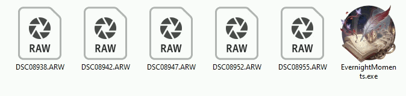
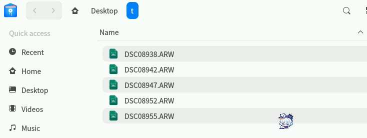

# [EvernightMoments](https://github.com/kagurazakayashi/EvernightMoments)

[English](README.md) | **简体中文** | [繁體中文](README.zh-Hant.md) | [日本語](README.ja.md)

**予瞬息以永恒，于长夜留余温。**

EvernightMoments 是一款通过提取照片原始拍摄时间，为您自动重命名影像文件的工具。

## 演示

演示时采用的设置：

1. 重命名格式: `<YYYY>-<MM>-<DD>_<HH>-<mm>-<ss>_<*>`
2. 预览确认：禁用
3. 结束时暂停：禁用

### 演示 1 (Windows 图形画面)

Windows 10 Pro 22H2



### 演示 2 (Bash 命令终端)

UOS 1072 Pro



## 下载

最新版本: v1.2.0

前往 [Releases](https://github.com/kagurazakayashi/EvernightMoments/releases) 下载最新版本。

| 操作系统 |    处理器     | 位数 | 软件压缩包名称                         |
| :------: | :-----------: | :--: | -------------------------------------- |
| windows  | Intel/AMD x86 |  32  | `EvernightMoments_v*_windows-x86.7z`   |
| windows  | Intel/AMD x86 |  64  | `EvernightMoments_v*_windows-x64.7z`   |
| windows  |      ARM      |  64  | `EvernightMoments_v*_windows-arm64.7z` |
|  macOS   |   Intel x86   |  64  | `EvernightMoments_v*_macos-x64.7z`     |
|  macOS   | Apple silicon |  64  | `EvernightMoments_v*_macos-arm64.7z`   |
|  Linux   | Intel/AMD x86 |  32  | `EvernightMoments_v*_linux-x86.7z`     |
|  Linux   | Intel/AMD x86 |  64  | `EvernightMoments_v*_linux-x64.7z`     |
|  Linux   |      ARM      |  32  | `EvernightMoments_v*_linux-arm32.7z`   |
|  Linux   |      ARM      |  64  | `EvernightMoments_v*_linux-arm64.7z`   |

带有 `ExifTool` 的包表示已经内置了 ExifTool 可执行文件。ExifTool 是可选的，但它提供了广泛的媒体文件支持和更新的相机支持。详细请查看[安装 ExifTool 以提高识别能力](#安装-exiftool-以提高识别能力)。

该程序已在以下平台进行测试：

- Windows 10 Pro 22H2, Windows 11 Pro 25H2, Windows Server 2025 24H2  (Intel & AMD x86_64)
- UOS Professional 1072 (Intel & AMD x86_64)
- Arch Linux 6.16 (Intel & AMD x86_64)
- macOS 15.7 (Intel)

## 安装和卸载

### 在 Windows 上安装

直接解压到一个不需要管理员权限就能写入的任意地方就可以了。

#### 安装到“发送到”菜单

将程序放到“发送到”菜单里面，可以随时通过在照片上点右键中的“发送到”菜单来使用本程序。

1. 按 `Windows+R` 快捷键打开“运行”对话框，然后输入 `shell:sendto` 并回车。
2. 将程序复制到新打开的文件夹窗口中。
3. 选中一个或多个 **照片文件** 或者 **内部只有照片的文件夹** 并点按鼠标右键，显示完整右键菜单，找到“发送到”菜单项，可以看到本程序。

#### 在命令行中随时用这个命令

1. 创建一个文件夹，把程序拷贝进去。
2. 复制该文件夹的路径。
3. 按 `Windows+R` 快捷键打开“运行”对话框，然后输入 `rundll32.exe sysdm.cpl,EditEnvironmentVariables` 并回车。
4. 选中 `Path` 并按“编辑”按钮。
5. 按“新建”按钮，将该文件夹的路径添加到里面。

#### 在 Windows 上卸载

- 删除所有相关文件和环境变量即可。

### 在 Linux 上安装

1. 解压到不需要 root 权限就能写入的地方。
2. 进入**终端**，使用以下命令:

```bash
cd 刚解压的文件目录
chmod +x install.sh
./install.sh
```

- 该脚本会自动完成：
  - 安装程序到 `~/.local/bin/EvernightMoments` 。
  - 安装图标资源到 `~/.local/share/icons/EvernightMoments.png` 。
  - 为配置程序创建程序列表项 `~/.local/share/applications/EvernightMoments.desktop` ，分类为“图形”。
  - 为配置程序创建桌面图标 `~/Desktop/EvernightMoments.desktop` 。
  - 将命令添加到 `~/.local/bin` 文件夹中以便在终端中随时使用。
    - 如果 `~/.local/bin` 不在 `PATH` 环境变量中，则会尝试自动添加。
- **注意：部分操作系统会拒绝没有签名的程序运行**，你需要允许没有签名的程序运行才能使用本程序。通常在图形画面下，如果被系统拒绝运行，可以看到弹框提示。
- 程序的配置将存储到 `~/.config/EvernightMoments/config.json` 。

#### 在 Linux 上卸载

```bash
cd 刚解压的文件目录
chmod +x uninstall.sh
./uninstall.sh
```

然后删除所有相关文件和环境变量。

### 在 macOS 上安装

1. 解压到不需要 root 权限就能写入的地方。
2. 进入**终端**，使用以下命令:

```bash
cd 刚解压的文件目录
chmod +x install.sh
./install-mac.sh
```

- 该脚本会自动完成：
  - 安装程序到 `~/.local/bin/EvernightMoments` 。
  - 生成配置程序 `~/Applications/EvernightMoments Config.app` 。
  - 为配置程序创建桌面图标 `~/Desktop/EvernightMoments Config.app` 。
    - 你可以将它从桌面上移动到 `/Applications` (应用程序文件夹)里面:
    - `mv "$HOME/Desktop/EvernightMoments Config.app" "/Applications/EvernightMoments Config.app"`
  - 将命令添加到 `~/.local/bin` 文件夹中以便在终端中随时使用。
    - 如果 `~/.local/bin` 不在 `PATH` 环境变量中，则会尝试自动添加。
- **注意：系统可能会拒绝没有签名的程序运行**，你需要允许没有签名的程序运行才能使用本程序。
  - 如果遇到阻止，请前往“系统设置”中的“隐私和安全性”，滚动到末端，找到“允许”按钮并点击。
- 程序的配置将存储到 `~/Library/Application Support/EvernightMoments/config.json` 。

#### 在 macOS 上卸载

```bash
cd 刚解压的文件目录
chmod +x uninstall.sh
./uninstall-mac.sh
```

然后删除所有相关文件和环境变量。

### 安装 ExifTool 以提高识别能力

本程序内置的 EXIF 解析器为 [goexif](https://github.com/rwcarlsen/goexif) ，它只能处理有限的格式。并且由于该库和本程序的更新限制，对新的照相机设备无法提供及时的支持。强烈建议您安装 ExifTool 来获取最新的相机支持能力。

[ExifTool](https://github.com/exiftool/exiftool) 是 Phil Harvey 开发的自由开源软件，专门用于处理图像、视频及音频的 metadata ，只要保持更新该程序，就能为本程序提供最新的相机 RAW 支持和处理更多类型的文件格式。

如果本程序找到了可用的 ExifTool ，会在起始输出的地方显示“EXIF 获取器”的文件路径。并且在重命名的时候，如果 ExifTool 成功获取时间，“时间来源”处会显示“ExifTool”。

有关 ExifTool 的下载和安装说明：

#### 使用包管理器安装 ExifTool

如果你的系统中安装有包管理器，可以使用你熟悉的包管理器完成快速安装。例如：

- Windows: `choco install exiftool` 或者 `scoop install exiftool`
- macOS: `brew install exiftool`
- Debian / Ubuntu / Mint: `sudo apt update && sudo apt install perl libimage-exiftool-perl`
- CentOS / RHEL / Fedora: `sudo dnf install perl perl-Image-ExifTool`
- Arch Linux: `sudo pacman -S perl perl-image-exiftool`

如果没有包管理器，可以按下面步骤安装：

#### 下载安装 ExifTool

先前往 [ExifTool 主页](https://github.com/exiftool/exiftool) 下载对应系统的最新版本程序。

- **Windows** 有两种方式:
  - **全局安装**: 请查看官方[安装和卸载说明](https://exiftool.org/install.html#Windows)操作。在完成后，应确保在“命令提示符”中任意位置可以输入 `exiftool.exe` 命令。
  - **只限本程序使用**: 你将得到一个 zip 文件，将该 zip 文件中所有的 ExifTool 文件解压缩到本程序文件夹内（确保 `exiftool(-k).exe` 或 `exiftool.exe` 和 `EvernightMoments.exe` 在同一个文件夹内）。
- **macOS**: 请查看官方[安装和卸载说明](https://exiftool.org/install.html#MacOS)操作。
- **Linux**: 请查看官方[安装和卸载说明](https://exiftool.org/install.html#Unix)操作。

## 使用说明

### 在 Windows 的图形画面中使用

- 在“文件资源管理器”中，可以将一个或多个 **照片文件** 或者 **内部只有照片的文件夹** 直接拖拽到这个 .exe 文件上，开始重命名操作。
- 可以通过“发送到”菜单使用，见[在 Windows 上安装](#在-windows-上安装) 。

### 通用命令

`[程序可执行文件名] [照片文件路径1] [照片文件路径2] ...`

- **程序可执行文件名**:
  - 已配置环境变量：
    - 直接在任意目录下使用 `EvernightMoments` 。
  - 从程序所在目录运行：
    - Windows 命令提示符 中类似于 `EvernightMoments.exe`
    - `Windows PowerShell` 中类似于 `.\EvernightMoments.exe`
    - macOS / Linux `sh` 中类似于 `./EvernightMoments`
- **照片文件路径**:
  - 支持 **多个文件** ，例如 `EvernightMoments.exe "C:\album1\photo1.arw" "C:\album1\photo2.arw"`
  - 支持 **多个文件夹** ，例如 `EvernightMoments.exe "C:\album1" "C:\album2"`
    - 如果指定的是一个文件夹，将尝试重命名该文件夹中的 **所有文件** 。
     - 默认不会修改子文件夹中的文件，如果需要同时修改子文件夹中的文件，请添加参数 `-r` 。

### 命令行参数

你可以通过命令行旗标临时取代配置文件中的任何设定项。每个参数都有短参数名（`-x`）和长参数名（`--xxx`）。文件/文件夹路径不需要参数名，放在最后即可，支持多个路径和通配符。

| 短参数 | 长参数             | 说明                                               | 示例                                            |
| :----- | :----------------- | :------------------------------------------------- | :---------------------------------------------- |
| `-l`   | `--language`       | 设定显示语言（`en`/`zh-Hans`/`zh-Hant`/`ja`）        | `-l en`                                         |
| `-f`   | `--format`         | 设定重新命名格式范本                                 | `-f "<YYYY>-<MM>-<DD>_<*>""`                    |
| `-e`   | `--exclude`        | 添加排除 glob 样式（可多次指定）                      | `-e "*.dop" -e "*.cos"`                         |
| `-s`   | `--sync`           | 添加同步 glob 样式（可多次指定）                      | `-s "*.dop"`                                    |
| `-y`   | `--confirm`        | 启用预览确认                                         | `-y`                                            |
| `-ny`  | `--no-confirm`     | 停用预览确认                                         | `-ny`                                           |
| `-p`   | `--pause`          | 启用结束后暂停等待                                     | `-p`                                            |
| `-np`  | `--no-pause`       | 停用结束后暂停等待                                     | `-np`                                           |
| `-x`   | `--exiftool`       | 设定 ExifTool 执行档路径（空字串可停用）                | `-x "C:\Tools\exiftool.exe"`                    |
| `-r`   | `--recursive`      | 递回处理子目录                                       | `-r`                                            |
| `-me`  | `--multi-ext`      | 将多层副档名视为档名的一部分                              | `-me`                                           |
| `-nc`  | `--no-color`       | 停用彩色终端输出                                       | `-nc`                                           |

**示例：**

```bash
# 覆写格式和语言，停用确认，递回处理
EvernightMoments -f "<YYYY>-<MM>-<DD>_<*>" -l en -ny -r "C:\Photos"

# 覆写 ExifTool 路径，添加排除样式
EvernightMoments -x "D:\exiftool.exe" -e "*.dop" -e "*.cos" "C:\album1" "C:\album2"

# 重命名多个文件夹中的 .ARW 文件，并同步 .ARW.dop 伴随文件
EvernightMoments -f "<YYYY><MM><DD>_<HH><mm><ss><*>" -s "*.ARW.dop" -ny "D:\DCIM\10860213" "D:\DCIM\11051228"
```

### AI 代理整合

本项目包含 [`SKILL.md`](SKILL.md) 文件，以面向 AI 代理优化的格式描述了工具架构、CLI 接口、配置结构和典型工作流。若要让你的 AI 助手理解并操作 EvernightMoments，请将此文件加载为技能或作为上下文提供。

## 软件配置

如果需要更改 语言、文件重命名的格式、排除项、同步项、ExifTool 路径、交互询问开关 等，请先进行软件配置：

**不带参数** 直接运行 `./EvernightMoments` (或者在 Windows 中直接双击 .exe )，将会进入全屏的 TUI 设置界面。

界面操作方式：

- 使用 `Tab` 或 `方向键` 在各项之间移动焦点。
- 在输入框中可直接键入内容；开关项按 `Enter` 或 `空格` 切换。
- 完成后选择 **「保存并退出」** 按钮写入配置；按 `Esc` 或选择 **「退出不保存」** 则放弃所有更改。

你可以进行以下设置：

### 1. 语言设置

- 在「语言」下拉选单中选择显示语言，界面文字会**即时**切换为所选语言。
- 选择会随其他设置一并保存，下次进入时自动选中。

### 2. 配置文件重命名的格式

- 在「命名格式」输入框中编辑重命名格式；底部信息区会**即时显示**生成示例，输入非法字符时会被即时拦截。
- 在格式中，可以使用以下**替代符**代指重命名时的信息。
- 注意：区分大小写。

| 替代符   |    输出示例 | 含义         |
| :------- | ----------: | ------------ |
| `<YY>`   |        `25` | 两位年份     |
| `<YYYY>` |      `2025` | 完整年份     |
| `<M>`    |         `5` | 月份         |
| `<MM>`   |        `05` | 两位月份     |
| `<D>`    |         `2` | 日           |
| `<DD>`   |        `02` | 两位日       |
| `<H>`    |         `9` | 小时         |
| `<HH>`   |        `09` | 两位小时     |
| `<m>`    |         `7` | 分钟         |
| `<mm>`   |        `07` | 两位分钟     |
| `<s>`    |         `3` | 秒           |
| `<ss>`   |        `03` | 两位秒       |
| `<#>`    |         `1` | 编号         |
| `<##>`   |        `01` | 统一位数编号 |
| `<*>`    | `photo.jpg` | 原始文件名   |

#### 注意事项

1. **不要输入系统不支持的符号！** 包括以下符号: `\ / : ? ' " | < * >`
   - 其中 Windows 中最终命名结果不能为 `CON, PRN, AUX, NUL, COM1~COM9, LPT1~LPT9`, 文件名结尾不能是 `.`
   - 使用系统不支持的符号可能导致重命名失败甚至损坏其他文件或文件系统。
2. 不支持 `<hh>` (12 小时格式)

#### 示例

原始文件名为 `photo.jpg` 时，采用默认值格式 `<YYYY><MM><DD>_<HH><mm><ss>_<*>` ，将会输出 `20260220_122937_Photo.jpg` 。

更多示例：

- `<YYYY><MM><DD>_<HH><mm><ss>*` -> `20250502_090703Photo.jpg`
- `<*>_<HH><mm><ss>` -> `Photo_193030.jpg`
- `<YY>年<M>月<D>日—*` -> `25年5月2日-Photo.jpg`
- `<YYYY>-<MM>-<DD>_<HH>-<mm>-<ss>_<*>` -> `2025-05-02_09-07-03_Photo.jpg`
- `<MM>-<DD>-<YYYY>_<HH>-<mm>-<ss>_<*>` -> `05-02-2025_09-07-03_Photo.jpg`
- `<DD>.<MM>.<YYYY>_<HH>.<mm>.<ss>_<*>` -> `02.05.2025_09.07.03_Photo.jpg`

### 3. 排除项（跳过这些文件）

- 在「排除项」输入框中填写要排除的路径样式，以英文逗号分隔。支持绝对路径和相对路径，不限于扩展名。示例：
  - `CaptureOne\Settings153\*.cos`
  - `*.dop`
- 命中的文件将不会被重命名。留空表示不排除任何文件。

### 4. 同步项（跟随主文件一起重命名）

- 在「同步项」输入框中填写需要同步重命名的路径样式，以英文逗号分隔。支持绝对路径和相对路径，不限于扩展名。示例：
  - `CaptureOne\Settings153\*.cos`
  - `*.dop`
- 当主照片文件被重命名时，同一文件夹中匹配的伴随文件会使用**相同**的新文件名一并重命名。
- **多扩展名伴随文件：** 对于包含多个扩展名的文件（如 `photo.ARW.dop`），工具会自动剥离中间扩展名以定位主文件（例如匹配 `photo.ARW` 或 `photo`）。
- **注意：** 同步项匹配的文件默认也属于排除项（它们不会根据自己的内容计算名字）。

### 5. ExifTool 路径

- 在「ExifTool 路径」输入框中指定 `exiftool` 可执行文件的路径，用于读取更精确的拍摄时间。
- 默认值为程序自动侦测到的路径；若未侦测到则为空。
- **留空**表示不使用 ExifTool，仅使用内置解析。
- 可点击下方的 **「自动侦测」** 按钮重新从系统 `PATH` 中侦测路径。

### 6. 是否在重命名前预览确认？

- 「询问预览」开关：勾选后会先向你展示会修改成什么样子，让你确认要不要继续。
- 取消勾选则直接开始重命名（请小心操作）。

### 7. 结束后是否等待“按回车键退出”？

- 「结束等待」开关：勾选后会在运行结束时停留，方便查看结果；取消勾选则结束后直接退出。

### 8. 将多层副檔名视为檔名？

- 「多层副檔名」开关：开启时仅剥离最后一层副檔名，中间层（如 `photo.ARW.dop` 中的 `.ARW`）保留为檔名的一部分。关闭时（预设）剥离所有副檔名，仅保留不含任何副檔名的基底名称。

### 9. 是否启用彩色输出？

- 「彩色输出」开关：勾选后终端输出会包含 ANSI 色彩码。若重定向输出或透过 AI 代理使用此工具，建议取消勾选。

## 编译

先安装 [Go](https://go.dev/) ，版本需大于等于 `1.26.0` 。

### 在 Windows 系统中编译

1. 使用 `mdhtml.bat` 创建帮助文档 (创建到 `readme` 文件夹中) 。
2. 使用 `build.bat` 编译到各个平台（编译到 `bin` 文件夹中）。

#### 测试

- 先创建 `TestPhotos` 文件夹，在里面放一些测试用的照片文件。
- `conf.bat`: 编译并进入配置模式。
- `test_dir.bat`: 编译并测试处理 `TestPhotos` 文件夹（包括所有文件）。
- `test_files.bat`: 测试多个文件输入（取自 `TestPhotos` 中的所有文件）。
- 如果测试时使用了默认格式对 `TestPhotos` 文件夹中的照片进行了重命名，可以执行 `python test_undo.py` 撤销重命名。

### 在 macOS / Linux 系统中编译

同上，把 `.bat` 换成 `.sh` 即可。

## LICENSE

Copyright (c) 2026 KagurazakaYashi EvernightMoments is licensed under Mulan PSL v2. You can use this software according to the terms and conditions of the Mulan PSL v2. You may obtain a copy of Mulan PSL v2 at: http://license.coscl.org.cn/MulanPSL2 THIS SOFTWARE IS PROVIDED ON AN “AS IS” BASIS, WITHOUT WARRANTIES OF ANY KIND, EITHER EXPRESS OR IMPLIED, INCLUDING BUT NOT LIMITED TO NON-INFRINGEMENT, MERCHANTABILITY OR FIT FOR A PARTICULAR PURPOSE. See the Mulan PSL v2 for more details.
